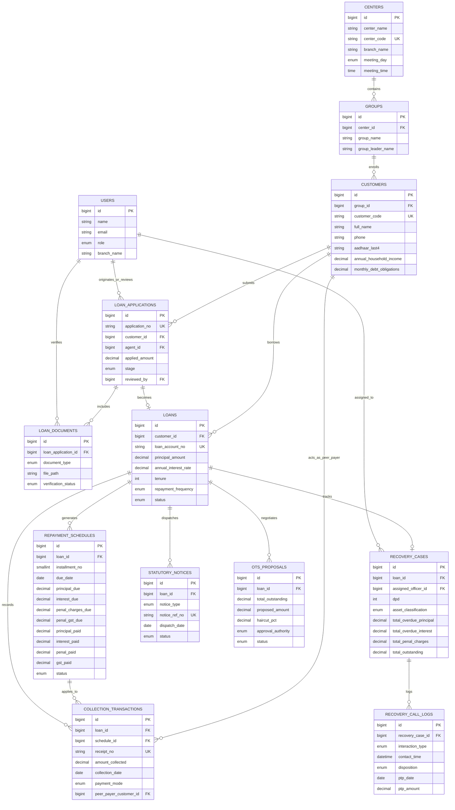
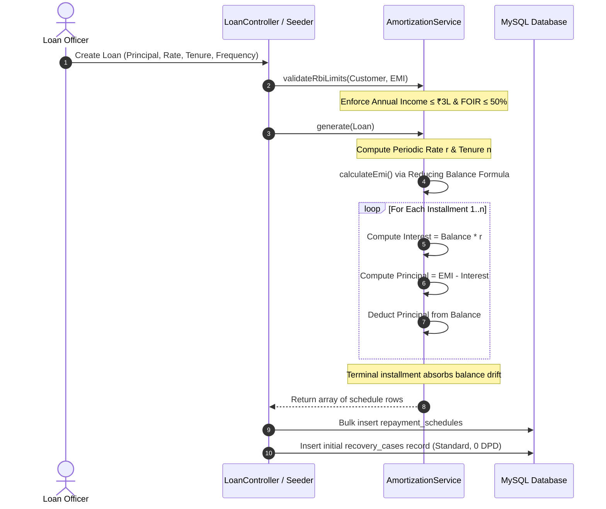
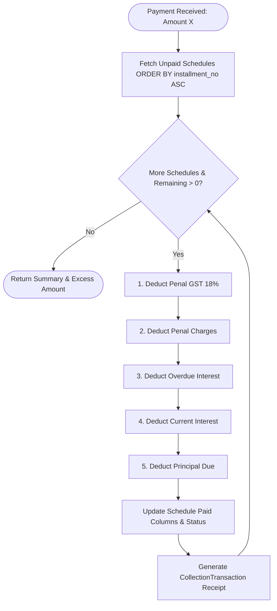

# 🏦 IndiaLend Pro — Loan Recovery & Core LMS ERP Architecture Masterclass

> **System Designation**: Indian SFB / NBFC-MFI Core Banking & Delinquency Recovery ERP  
> **Codebase Target**: `c:\xampp\htdocs\loan_erp`  
> **Framework & Runtime**: Laravel 12.x · PHP 8.2+ · MySQL 8.x (XAMPP) · Tailwind CSS · Alpine.js  
> **Regulatory Frameworks Enforced**: RBI Master Direction – Microfinance Loans (2022) · RBI Fair Lending Practices – Penal Charges (2023) · RBI Fair Practices Code for Recovery · NI Act 1881 §138 · PSSA 2007 §25

---

## Table of Contents
1. [System Overview & ERP Fundamentals](#1-system-overview--erp-fundamentals)
   - [Core Objectives](#core-objectives)
   - [The Indian Microfinance Operating Model (JLG / Kendra)](#the-indian-microfinance-operating-model-jlg--kendra)
   - [Regulatory Invariants (RBI Compliance)](#regulatory-invariants-rbi-compliance)
2. [Architecture & Tech Stack](#2-architecture--tech-stack)
   - [Technology Stack Matrix](#technology-stack-matrix)
   - [Architectural Patterns](#architectural-patterns)
   - [Database Entity Relationship Model (ERD)](#database-entity-relationship-model-erd)
3. [Directory Structure & Navigation Map](#3-directory-structure--navigation-map)
   - [High-Level Directory Blueprint](#high-level-directory-blueprint)
   - [Critical Module Locations](#critical-module-locations)
4. [Core Workflows & End-to-End Data Flow](#4-core-workflows--end-to-end-data-flow)
   - [Workflow 1: Loan Origination System (LOS) Pipeline](#workflow-1-loan-origination-system-los-pipeline)
   - [Workflow 2: Customer Onboarding & KYC Compliance](#workflow-2-customer-onboarding--kyc-compliance)
   - [Workflow 3: Loan Origination & Reducing-Balance Amortization](#workflow-3-loan-origination--reducing-balance-amortization)
   - [Workflow 4: Kendra Collection Day Sheet (CDS) Processing](#workflow-4-kendra-collection-day-sheet-cds-processing)
   - [Workflow 5: The Indian Banking Repayment Waterfall](#workflow-5-the-indian-banking-repayment-waterfall)
   - [Workflow 6: EOD Batch Processing (DPD Recalculation & Asset Classification)](#workflow-6-eod-batch-processing-dpd-recalculation--asset-classification)
   - [Workflow 7: Delinquency Engagement & Calling Console (RBI Contact Hours)](#workflow-7-delinquency-engagement--calling-console-rbi-contact-hours)
   - [Workflow 8: Statutory Legal Escalation & One-Time Settlement (OTS)](#workflow-8-statutory-legal-escalation--one-time-settlement-ots)
5. [Component Deep Dive](#5-component-deep-dive)
   - [Domain Services Layer](#domain-services-layer)
   - [Controller & HTTP Presentation Layer](#controller--http-presentation-layer)
   - [Database Schema & Migration Dictionary](#database-schema--migration-dictionary)
   - [Eloquent Models & Business Accessors](#eloquent-models--business-accessors)
6. [Debugging & Troubleshooting Guide](#6-debugging--troubleshooting-guide)
   - [Step-by-Step Data Tracing](#step-by-step-data-tracing)
   - [Common Failure Points & Edge Cases](#common-failure-points--edge-cases)
   - [Artisan Diagnostic Commands & MySQL Verification Queries](#artisan-diagnostic-commands--mysql-verification-queries)
   - [Tinker Playbook for Rapid Simulation](#tinker-playbook-for-rapid-simulation)

---

## 1. System Overview & ERP Fundamentals

### Core Objectives
An Enterprise Resource Planning (ERP) platform in lending is fundamentally a **stateful transactional ledger** coupled with **regulatory policy engines**. The **IndiaLend Pro** platform bridges two distinct yet tightly integrated domains:

1. **Loan Management System (LMS)**: Originates credit facilities, generates legally compliant amortization schedules, tracks weekly/monthly collection meetings across rural centers, and handles payment appropriations.
2. **Delinquency Recovery Management System (DRMS)**: Monitors credit portfolio degradation, tracks Days Past Due (DPD), manages regulatory asset reclassifications (SMA and NPA), governs field/telecalling recovery operations under strict ethical time-locks, and drives legal notice dispatch and One-Time Settlement (OTS) workouts.

```
        ┌────────────────────────────────────────────────────────┐
        │                   IndiaLend Pro ERP                    │
        └───────────────────────────┬────────────────────────────┘
                                    │
          ┌─────────────────────────┼───────────────────────────┐
          ▼                         ▼                           ▼
┌──────────────────┐     ┌────────────────────┐      ┌───────────────────┐
│ LOS (Origination)│     │ LMS (Performing)   │      │ DRMS (Delinquent) │
├──────────────────┤     ├────────────────────┤      ├───────────────────┤
│ • Agent Sourcing │     │ • Center & Group   │      │ • DPD Aging Engine│
│ • App Drafting   │     │ • KYC & FOIR       │      │ • SMA/NPA Buckets │
│ • Doc Verify     │     │ • Reducing-Bal     │      │ • Contact Log     │
│ • Manager Review │     │ • Kendra CDS       │      │ • §138 NI Legal   │
│ • Sanction/Reject│     │ • 5-Stage Waterfall│      │ • OTS Calculator  │
└──────────────────┘     └────────────────────┘      └───────────────────┘
```

### The Indian Microfinance Operating Model (JLG / Kendra)
Unlike commercial banking where loans are serviced individually via automated standing instructions, Indian Microfinance Institutions (NBFC-MFIs) and Small Finance Banks (SFBs) leverage the **Joint Liability Group (JLG)** framework (adapted from the Grameen model):

- **Kendra / Center**: A village- or ward-level aggregation of 20–50 borrowers that convenes at a fixed weekday and time (e.g., *Hajo Kendra, Mondays @ 09:30 AM*).
- **JLG Group**: A mutual-guarantee cell of 4 to 10 women micro-entrepreneurs. Members co-guarantee one another’s credit. If Borrower $A$ experiences temporary cash-flow stress during the weekly center meeting, Borrower $B$ can step in with a **Peer-Payment Contribution**.
- **Collection Day Sheet (CDS)**: The operational artifact generated for Field Officers (Kendra Managers) detailing every group member’s scheduled installment, past-due arrears, and total expected collection for that morning's meeting.

### Regulatory Invariants (RBI Compliance)
Lending ERP architectures in India must embed statutory and regulatory constraints directly into business logic rather than treating them as external guidelines:

| Regulatory Mandate | Regulatory Source | Code Enforcement Location | Architectural Consequence |
|---|---|---|---|
| **Annual Household Income Cap** (₹3,00,000) | RBI Master Direction 2022 | [AmortizationService.php](file:///c:/xampp/htdocs/loan_erp/app/Services/AmortizationService.php#L31-L40) | Blocks loan origination if customer income exceeds ₹3 Lakhs. |
| **Fixed Obligation to Income Ratio (FOIR)** $\le 50\%$ | RBI Master Direction 2022 | [AmortizationService.php](file:///c:/xampp/htdocs/loan_erp/app/Services/AmortizationService.php#L42-L60) | Monthly total debt obligations (existing + new EMI) cannot exceed 50% of monthly household income. |
| **Zero Prepayment Penalties** | RBI Fair Practices Code | Entire Codebase | No penalty fee can be calculated or deducted for early closure of microfinance facilities. |
| **Non-Capitalisation of Penal Charges** | RBI Fair Lending Circular 2023 | [UpdateDpd.php](file:///c:/xampp/htdocs/loan_erp/app/Console/Commands/UpdateDpd.php#L93-L111) | Penal charges are treated as operational charges (₹100 + 18% GST = ₹118/bounce). They are **never** compounded or added to loan principal. |
| **Contact Hour Restrictions** (08:00–19:00) | RBI Recovery Code of Conduct | [RecoveryController.php](file:///c:/xampp/htdocs/loan_erp/app/Http/Controllers/RecoveryController.php#L54-L66) | Telecalls and field visits recorded outside 08:00 AM – 07:00 PM are rejected by both client-side Alpine guards and server-side HTTP validators. |
| **KYC Aadhaar Masking** | UIDAI / RBI KYC Directions | [Customer.php](file:///c:/xampp/htdocs/loan_erp/app/Models/Customer.php#L36-L39) | Only the last 4 digits are persisted; views render `XXXX-XXXX-1234` to prevent PII leakage. |

---

## 2. Architecture & Tech Stack

### Technology Stack Matrix
The codebase uses a modern, performant, and maintainable stack designed for rapid execution and operational reliability on PHP 8.2+:

```
┌────────────────────────────────────────────────────────────────────────┐
│                          PRESENTATION LAYER                            │
│  Blade SSR Layouts · Tailwind CSS v3 · Alpine.js v3 · DataTables v1.13 │
└──────────────────────────────────┬─────────────────────────────────────┘
                                   │ HTTP Requests / JSON AJAX
┌──────────────────────────────────▼─────────────────────────────────────┐
│                          APPLICATION CONTROLLERS                       │
│  LosController · LmsController · LoanController · RecoveryController   │
│  LegalController · AdminController · AuthController · DashboardControl │
└──────────────────────────────────┬─────────────────────────────────────┘
                                   │ Domain Calls
┌──────────────────────────────────▼─────────────────────────────────────┐
│                          DOMAIN SERVICES LAYER                         │
│  LoanOriginationService (LOS) · AmortizationService (EMI & FOIR)       │
│  RepaymentWaterfallService (Ledger)                                    │
└──────────────────────────────────┬─────────────────────────────────────┘
                                   │ Transactions & Batch CLI
┌──────────────────────────────────▼─────────────────────────────────────┐
│                       PERSISTENCE & BATCH LAYER                        │
│  Eloquent ORM · MySQL 8.x Database · sfb:update-dpd Batch Worker       │
└────────────────────────────────────────────────────────────────────────┘
```

- **Backend Framework**: **Laravel 12.x** running on **PHP 8.2+**. Leverages strict scalar typing, constructor property promotion, match expressions, and transactional closures.
- **Database Engine**: **MySQL 8.0+** (configured via XAMPP on port 3306). Strict foreign key cascades maintain referential integrity. Exact currency amounts use `DECIMAL(12, 2)` to eliminate binary floating-point drift.
- **Frontend Architecture**:
  - **Blade Engine**: Layout inheritance (`layouts/app.blade.php`) with reusable alert components and Indian number formatters (`₹XX,XX,XXX.00`).
  - **Tailwind CSS v3**: Utility-first styling with custom palette tokens (`brand`, `saffron`, `emerald`, `rose`).
  - **Alpine.js v3**: Declarative client reactivity handling tab switching, modal dialogs, dynamic schedule calculation, and client-side contact hour validation.
  - **Chart.js & DataTables**: Interactive portfolio delinquency distribution visualizer and client-paginated installment ledger search.

### Architectural Patterns

#### 1. Domain Service Layer Pattern
Financial rules and calculations are extracted from Controllers and Eloquent models into stateless domain service classes:
- [`LoanOriginationService`](file:///c:/xampp/htdocs/loan_erp/app/Services/LoanOriginationService.php): Encapsulates LOS logic, stage progression, document status validation, and final loan account creation from an approved application.
- [`AmortizationService`](file:///c:/xampp/htdocs/loan_erp/app/Services/AmortizationService.php): Handles reducing-balance compounding, weekly/monthly period scaling, last-installment rounding absorption, and RBI FOIR threshold verification.
- [`RepaymentWaterfallService`](file:///c:/xampp/htdocs/loan_erp/app/Services/RepaymentWaterfallService.php): Implements the statutory sequence of recovery appropriation wrapped within database transactions (`DB::transaction()`).

#### 2. EOD/BOD Batch Command Pattern
Core banking systems do not calculate asset aging dynamically on every page load because doing so would exhaust database I/O. Instead, they rely on an End-of-Day (EOD) batch run:
- [`UpdateDpd`](file:///c:/xampp/htdocs/loan_erp/app/Console/Commands/UpdateDpd.php) (`php artisan sfb:update-dpd`): Runs once daily at midnight to scan overdue installment dates, reclassify loan delinquency buckets, levy bounced penal charges, and synchronize `recovery_cases`.

#### 3. Delegated Authority Workout Pattern
Credit settlements cannot be arbitrarily approved by frontline staff:
- In [`LegalController.php`](file:///c:/xampp/htdocs/loan_erp/app/Http/Controllers/LegalController.php#L71-L76), One-Time Settlement (OTS) haircuts dynamically compute the necessary corporate approval tier (`Branch_Manager` $\le 20\%$, `Regional_Credit_Committee` $21\text{--}40\%$, `Board` $> 40\%$) based on financial exposure.

### Database Entity Relationship Model (ERD)



---

## 3. Directory Structure & Navigation Map

### High-Level Directory Blueprint

```
loan_erp/
├── app/
│   ├── Console/Commands/
│   │   └── UpdateDpd.php               # [CLI] sfb:update-dpd EOD aging & penalty batch
│   ├── Http/Controllers/
│   │   ├── Controller.php              # Base Laravel Controller
│   │   ├── DashboardController.php     # GLP, PAR 30, NPA%, Collection Efficiency
│   │   ├── LmsController.php           # Kendra Collection Day Sheet (CDS)
│   │   ├── LoanController.php          # Loan Ledger view & Repayment processing
│   │   ├── RecoveryController.php      # Delinquency console & ethical call logging
│   │   ├── LegalController.php         # Statutory notices (§138, §25) & OTS engine
│   │   ├── LosController.php           # Loan origination & underwriting pipeline
│   │   ├── AdminController.php         # User management, roles, branches & config
│   │   └── AuthController.php          # Authentication login/logout logic
│   ├── Models/
│   │   ├── Center.php                  # Kendra operational units
│   │   ├── Group.php                   # Joint Liability Groups (JLGs)
│   │   ├── Customer.php                # KYC, Aadhaar masking, FOIR logic
│   │   ├── LoanApplication.php         # Pre-sanction loan applications & stages
│   │   ├── LoanDocument.php            # KYC & Income documents with verification
│   │   ├── Loan.php                    # Loan accounts, active balances
│   │   ├── RepaymentSchedule.php       # Installment amortizations & paid balances
│   │   ├── CollectionTransaction.php   # Immutable receipts with peer-payer tracking
│   │   ├── RecoveryCase.php            # DPD, SMA/NPA status, overdue sums
│   │   ├── RecoveryCallLog.php         # Customer interactions, PTP commitments
│   │   ├── StatutoryNotice.php         # Formal legal letters & postal tracking
│   │   ├── OtsProposal.php             # Settlement haircut calculations & governance
│   │   └── User.php                    # Internal system operators, roles & branches
│   ├── Providers/
│   │   └── AppServiceProvider.php      # App service bootstrapping
│   └── Services/
│       ├── AmortizationService.php     # Reducing-balance math, FOIR & RBI limits
│       └── RepaymentWaterfallService.php # 5-stage legal appropriation algorithm
├── database/
│   ├── migrations/                     # 10 domain schema definitions
│   └── seeders/
│       ├── DatabaseSeeder.php          # Main seed orchestrator
│       └── IndianMfiSeeder.php         # Full Assam Kendra demo dataset
├── resources/
│   └── views/
│       ├── auth/
│       │   └── login.blade.php         # Authentication screen
│       ├── layouts/
│       │   └── app.blade.php           # Sidebar, navbar, Tailwind & Alpine setup
│       ├── dashboard/
│       │   └── index.blade.php         # Executive portfolio KPI dashboard & chart
│       ├── los/
│       │   ├── group/
│       │   │   ├── center.blade.php    # Kendra creation & management
│       │   │   ├── group.blade.php     # JLG group formation under a Kendra
│       │   │   └── member.blade.php    # Customer KYC & member onboarding
│       │   ├── apply.blade.php         # Origination form for field agents
│       │   ├── my_applications.blade.php # View personal applications (agents)
│       │   ├── pipeline.blade.php      # Manager queue & sanctioning workflow
│       │   └── review.blade.php        # Deep review & document verification
│       ├── lms/
│       │   ├── cds.blade.php           # Kendra Collection Day Sheet
│       │   └── loan_ledger.blade.php   # Account ledger & Collect Repayment modal
│       ├── recovery/
│       │   ├── console.blade.php       # Delinquency console & Log Contact modal
│       │   ├── legal.blade.php         # Notices registry & OTS Calculator tab
│           └── partials/
│               ├── notice_sec138.blade.php  # Printable §138 NI Act demand notice
│               ├── notice_sec25.blade.php   # Printable §25 PSSA auto-debit notice
│               └── notice_recall.blade.php  # Printable Loan Acceleration Notice
├── routes/
│   └── web.php                         # All web endpoints & resource routes
└── docs.md                             # Comprehensive technical documentation
```

### Critical Module Locations

| Responsibility | Primary File | Supporting Files |
|---|---|---|
| **Origination & Verification** | [`LosController.php`](file:///c:/xampp/htdocs/loan_erp/app/Http/Controllers/LosController.php) | [`LoanOriginationService.php`](file:///c:/xampp/htdocs/loan_erp/app/Services/LoanOriginationService.php), [`LoanApplication.php`](file:///c:/xampp/htdocs/loan_erp/app/Models/LoanApplication.php) |
| **Amortization & Math** | [`AmortizationService.php`](file:///c:/xampp/htdocs/loan_erp/app/Services/AmortizationService.php) | [`Loan.php`](file:///c:/xampp/htdocs/loan_erp/app/Models/Loan.php), [`RepaymentSchedule.php`](file:///c:/xampp/htdocs/loan_erp/app/Models/RepaymentSchedule.php) |
| **Payment Waterfall** | [`RepaymentWaterfallService.php`](file:///c:/xampp/htdocs/loan_erp/app/Services/RepaymentWaterfallService.php) | [`LoanController.php`](file:///c:/xampp/htdocs/loan_erp/app/Http/Controllers/LoanController.php), [`CollectionTransaction.php`](file:///c:/xampp/htdocs/loan_erp/app/Models/CollectionTransaction.php) |
| **DPD Aging & Classification**| [`UpdateDpd.php`](file:///c:/xampp/htdocs/loan_erp/app/Console/Commands/UpdateDpd.php) | [`RecoveryCase.php`](file:///c:/xampp/htdocs/loan_erp/app/Models/RecoveryCase.php) |
| **Kendra Day Collections** | [`LmsController.php`](file:///c:/xampp/htdocs/loan_erp/app/Http/Controllers/LmsController.php) | [`cds.blade.php`](file:///c:/xampp/htdocs/loan_erp/resources/views/lms/cds.blade.php) |
| **Recovery Telecalling** | [`RecoveryController.php`](file:///c:/xampp/htdocs/loan_erp/app/Http/Controllers/RecoveryController.php) | [`console.blade.php`](file:///c:/xampp/htdocs/loan_erp/resources/views/recovery/console.blade.php), [`RecoveryCallLog.php`](file:///c:/xampp/htdocs/loan_erp/app/Models/RecoveryCallLog.php) |
| **Statutory Notices & OTS** | [`LegalController.php`](file:///c:/xampp/htdocs/loan_erp/app/Http/Controllers/LegalController.php) | [`legal.blade.php`](file:///c:/xampp/htdocs/loan_erp/resources/views/recovery/legal.blade.php), [`OtsProposal.php`](file:///c:/xampp/htdocs/loan_erp/app/Models/OtsProposal.php) |

---

## 4. Core Workflows & End-to-End Data Flow

### Workflow 1: Loan Origination System (LOS) Pipeline
The new LOS separates loan servicing from application processing, implementing a multi-role pipeline with strict document verification.

```
Agent Submits ──► Docs Verified (Manager/Admin) ──► Review ──► Sanction / Reject ──► Loan Account Created
```

1. **Submission**: Agent fills out an application and uploads required KYC/Income documents (e.g. `aadhaar_card`, `bank_passbook`).
2. **Verification**: Manager reviews the document uploads and sets their `verification_status` to `verified` or `rejected`.
3. **Approval**: An application cannot be sanctioned until all associated documents are verified. Once approved, [`LoanOriginationService::approveApplication()`](file:///c:/xampp/htdocs/loan_erp/app/Services/LoanOriginationService.php) triggers the LMS to generate the formal `Loan` and repayment schedules.
4. **Rejection**: Generates a terminal state with a `rejection_reason`.

### Workflow 2: Customer Onboarding & KYC Compliance
Before any loan can be created, the borrower is enrolled into a JLG group under a Kendra. This hierarchy is managed by Field Agents via the `los/center`, `los/group`, and `los/member` interfaces.

```
Agent Creates Kendra ──► Agent Forms JLG Group ──► Onboards Member (Income/KYC) ──► Persist Customer
```

1. The customer profile records `annual_household_income` and `monthly_debt_obligations`.
2. Model accessor [`Customer::getFoirPercentAttribute()`](file:///c:/xampp/htdocs/loan_erp/app/Models/Customer.php#L52-L56) calculates:
   $$\text{Monthly Income} = \frac{\text{Annual Household Income}}{12}$$
   $$\text{FOIR} = \left(\frac{\text{Monthly Debt Obligations}}{\text{Monthly Income}}\right) \times 100$$
3. If FOIR $> 50\%$, the system flags an eligibility violation.
4. Aadhaar privacy is enforced by storing only `aadhaar_last4` and rendering via [`Customer::getMaskedAadhaarAttribute()`](file:///c:/xampp/htdocs/loan_erp/app/Models/Customer.php#L36-L39).

### Workflow 3: Loan Origination & Reducing-Balance Amortization
When a loan account is opened, [`AmortizationService::generate()`](file:///c:/xampp/htdocs/loan_erp/app/Services/AmortizationService.php#L69-L134) generates the installment schedule:



#### The Mathematical Formulation
Given principal $P$, annual rate $R$, and frequency (weekly or monthly):
1. **Periodic Rate ($r$)**:
   $$r = \begin{cases} \frac{R}{52 \times 100} & \text{if weekly} \\ \frac{R}{12 \times 100} & \text{if monthly} \end{cases}$$
2. **Equated Periodic Installment ($EMI$)**:
   $$EMI = \frac{P \cdot r \cdot (1+r)^n}{(1+r)^n - 1}$$
3. **Terminal Adjustment**:
   On installment $n$, rounding accumulation could leave a small remnant. The service sets:
   $$\text{Principal Due}_n = \text{Balance}_{n-1}$$
   This guarantees that closing balance reaches exactly ₹0.00.

### Workflow 4: Kendra Collection Day Sheet (CDS) Processing
Field Officers conduct Kendra meetings weekly. The CDS serves as their field audit sheet.

1. Field Officer accesses `/lms/cds` with `center_id` and `collection_date`.
2. [`LmsController::cds()`](file:///c:/xampp/htdocs/loan_erp/app/Http/Controllers/LmsController.php#L18-L42) loads:
   - All groups in the Kendra.
   - All customers in each group.
   - Active loans and repayment schedules due on or before the selected date with status `['pending', 'partial', 'overdue']`.
3. The officer collects cash/UPI from each member. If a member is short, a peer borrower in the group can contribute on their behalf, recorded in `peer_payer_customer_id`.

### Workflow 5: The Indian Banking Repayment Waterfall
Payment appropriation in Indian banking is strictly regulated to protect borrowers from predatory debt spirals. An incoming payment cannot be credited arbitrarily to principal to reduce interest income, nor can it be consumed entirely by uncapitalised penalties before servicing basic interest.

[`RepaymentWaterfallService::apply()`](file:///c:/xampp/htdocs/loan_erp/app/Services/RepaymentWaterfallService.php#L37-L157) executes this exact 5-tier waterfall across the oldest unpaid schedules first:



#### Waterfall Priority Sequence
1. **Tier 1: Penal GST (18%)**: Statutory government tax liability.
2. **Tier 2: Penal Charges**: Fixed bounce fee (₹100), non-capitalised.
3. **Tier 3: Past Overdue Interest**: Unpaid interest accrued from earlier defaulted cycles.
4. **Tier 4: Current Interest**: Interest component of the current installment.
5. **Tier 5: Principal Balance**: Reduces the outstanding capital balance.

If total paid $\ge (\text{Total Due} + \text{Penal} + \text{GST} - 0.01)$, schedule status transitions to `paid`. If partially covered, status becomes `partial`.

### Workflow 6: EOD Batch Processing (DPD Recalculation & Asset Classification)
Every night, the `sfb:update-dpd` console command executes:

```bash
php artisan sfb:update-dpd
```

#### Step-by-Step EOD Execution Logic
1. Queries all loans where `status IN ('active', 'npa')` with their `repaymentSchedules`.
2. Locates the **oldest unpaid installment** where `due_date < today`.
3. Calculates **Days Past Due (DPD)**:
   $$\text{DPD} = \text{today} - \text{oldest\_unpaid\_due\_date}$$
   If no overdue schedules exist, $\text{DPD} = 0$, and asset classification is reset to `Standard`.
4. Maps DPD to the statutory **RBI IRACP Classification**:

| DPD Range | Asset Classification | System Meaning | Operational Escalation |
|---|---|---|---|
| **0 DPD** | `Standard` | Healthy performing asset | Regular Kendra collection |
| **1 – 30 DPD** | `SMA-0` | Special Mention Account 0 | Field visit & soft telecalling |
| **31 – 60 DPD** | `SMA-1` | Special Mention Account 1 | Kendra Supervisor field visit |
| **61 – 90 DPD** | `SMA-2` | Special Mention Account 2 | Pre-NPA statutory notice generation |
| **91 – 365 DPD** | `NPA_SubStandard`| Non-Performing Asset | Loan status $\to$ `npa`; Recall notice; §138 / §25 legal filing |
| **> 365 DPD** | `Doubtful` | Severe Default (12+ mos) | Lok Adalat / OTS Workout / Write-off |

5. **Penal Levy**: For every newly overdue schedule where `penal_charges_due == 0.0`, the engine adds ₹100 penal charge + ₹18 GST ($18\%$).
   > **RBI Fair Lending Rule**: The penal charge is stored in `penal_charges_due` on the schedule record. It is **never** added to `principal_due` or compounding balances.
6. **Upserts `recovery_cases`**: Synchronizes total overdue principal, overdue interest, penal charges, and total outstanding. If $\text{DPD} \ge 91$, updates `loans.status = 'npa'`.

### Workflow 7: Delinquency Engagement & Calling Console (RBI Contact Hours)
Field agents and call center recovery executives navigate `/recovery/console` to manage overdue loans.

```
Agent Selects Case ──► Inspects Overdue & DPD ──► Log Interaction ──► RBI 08:00-19:00 Guard ──► Update Last Contacted
```

- **Dual-Layer Time-Lock Enforcement**:
  - **Client-side**: In [`console.blade.php`](file:///c:/xampp/htdocs/loan_erp/resources/views/recovery/console.blade.php#L148-L158), Alpine.js checks input hours:
    $$\text{Minutes} = \text{Hour} \times 60 + \text{Minute}$$
    If $\text{Minutes} < 480 \text{ (08:00 AM)}$ or $\text{Minutes} > 1140 \text{ (07:00 PM)}$, the submission is blocked with an alert.
  - **Server-side**: In [`RecoveryController::logContact()`](file:///c:/xampp/htdocs/loan_erp/app/Http/Controllers/RecoveryController.php#L54-L66), Carbon parses `contact_time`. If outside $08:00\text{--}19:00$, the request is rejected with validation errors.
- **Dispositions Tracked**: `PTP` (Promise to Pay with target date and amount), `Broken_PTP`, `Dispute`, `Absconding`, `Crop_Failure`, `Medical_Emergency`, `RNR` (Ring No Response), and `Paid`.

### Workflow 8: Statutory Legal Escalation & One-Time Settlement (OTS)
When accounts advance to SMA-2 and NPA, legal proceedings and compromise settlements are governed via `/recovery/legal`:

#### Statutory Notices
- **Section 138 NI Act (Negotiable Instruments Act, 1881)**: Dispatched for dishonoured repayment cheques. Demands full settlement within a 15-day statutory window before filing a criminal complaint before the JMFC Magistrate.
- **Section 25 PSSA (Payment and Settlement Systems Act, 2007)**: Dispatched when electronic auto-debit mandates (NACH / e-NACH / UPI AutoPay) bounce. Treated as equivalent to cheque bounce criminal liability.
- **Loan Recall Notice**: Contractual acceleration clause terminating the loan tenure and demanding immediate repayment of total outstanding dues.

#### OTS Haircut & Approval Hierarchy
Borrowers facing severe distress can submit a compromise proposal. In [`LegalController::otsCalculate()`](file:///c:/xampp/htdocs/loan_erp/app/Http/Controllers/LegalController.php#L37-L107), waivers are appropriated in sequence:
$$\text{Total Waiver} = \max(0, \text{Total Outstanding} - \text{Proposed Amount})$$
$$\text{Haircut } \% = \left(\frac{\text{Total Waiver}}{\text{Total Outstanding}}\right) \times 100$$

Waivers absorb non-principal debt first:
1. **Penal & GST Waiver**: Absorbs up to total unpaid penal fees.
2. **Interest Waiver**: Absorbs remaining waiver against overdue interest.
3. **Principal Haircut**: The residual waiver that actually cuts into disbursed capital.

The haircut determines the statutory approving body:
- $\le 20\%$ Haircut $\longrightarrow$ **Branch Manager**
- $21\% \text{ to } 40\%$ Haircut $\longrightarrow$ **Regional Credit Committee (RCC)**
- $> 40\%$ Haircut $\longrightarrow$ **Board of Directors**

---

## 5. Component Deep Dive

### Domain Services Layer

#### `AmortizationService`
Located at: [`app/Services/AmortizationService.php`](file:///c:/xampp/htdocs/loan_erp/app/Services/AmortizationService.php)

- `validateRbiLimits(Customer $customer, float $emiAmount): void`
  - Validates `customer->annual_household_income <= 300000`.
  - Computes $\text{FOIR} = ((\text{monthly debt obligations} + \text{emi}) / (\text{annual income} / 12)) \times 100$. Throws `InvalidArgumentException` if $> 50\%$.
- `calculateEmi(float $principal, float $periodicRate, int $tenure): float`
  - Applies standard annuity factor: $\frac{P \cdot r \cdot (1+r)^n}{(1+r)^n - 1}$. Handles $0\%$ interest loans gracefully via simple division.
- `generate(Loan $loan, bool $validateRbi = true): array`
  - Generates the full array of installment dictionaries. Iterates through tenure, calculating periodic interest, subtracting from EMI to determine principal, maintaining opening and closing balances, and adjusting the final installment.
- `penalChargeForBounce(): array`
  - Returns `['penal' => 100.00, 'gst' => 18.00, 'total' => 118.00]`.

#### `RepaymentWaterfallService`
Located at: [`app/Services/RepaymentWaterfallService.php`](file:///c:/xampp/htdocs/loan_erp/app/Services/RepaymentWaterfallService.php)

- `apply(Loan $loan, float $amountCollected, string $paymentMode, string $collectedBy, ...): array`
  - Encloses processing in `DB::transaction()`.
  - Queries unpaid/partial/overdue schedules ordered by `installment_no ASC`.
  - Decrements available cash across 5 sequential tiers.
  - Updates schedule columns: `gst_paid`, `penal_paid`, `interest_paid`, `principal_paid`, `total_paid`, and `status`.
  - Creates unique `CollectionTransaction` receipt records (`'RCP' . strtoupper(uniqid())`).
  - Supports `peer_payer_customer_id` for JLG peer payments.

### Controller & HTTP Presentation Layer

| Controller | Method | Route | HTTP | Description |
|---|---|---|---|---|
| **DashboardController** | `index()` | `/` (`dashboard`) | `GET` | Aggregates GLP, today's due, PAR30%, Gross NPA%, 30-day collection efficiency, and bucket breakdown counts. |
| **LmsController** | `cds()` | `/lms/cds` (`lms.cds`) | `GET` | Loads Kendra Collection Day Sheet filtered by center and meeting date, nesting groups, customers, and active schedules. |
| **LoanController** | `show($id)` | `/lms/loans/{id}` (`lms.loans.show`) | `GET` | Renders Loan Ledger with borrower KYC, loan details, full schedule table, and past payment transactions. |
| **LoanController** | `collect(..., $id)`| `/lms/loans/{id}/collect` (`lms.loans.collect`) | `POST`| Validates collection inputs and delegates to `RepaymentWaterfallService::apply()`. |
| **RecoveryController**| `console()` | `/recovery/console` (`recovery.console`) | `GET` | Renders delinquency bucket tabs (SMA-0, 1, 2, NPA), filterable case table, and pagination. |
| **RecoveryController**| `logContact(...)`| `/recovery/log-contact` (`recovery.log-contact`)| `POST`| Validates contact time against 08:00–19:00 RBI window, creates `RecoveryCallLog`, updates `recovery_cases.last_contacted_at`. |
| **LegalController** | `index()` | `/recovery/legal` (`recovery.legal`) | `GET` | Displays Statutory Notices registry, pending OTS proposals, and eligible NPA accounts. |
| **LegalController** | `otsCalculate(...)`| `/recovery/legal/ots` (`recovery.legal.ots`)| `POST`| Returns JSON breakdown for interactive calculator or saves a persistent `OtsProposal`. |
| **LegalController** | `noticePreview($id)`| `/recovery/legal/notice/{id}` (`recovery.legal.notice`)| `GET` | Renders printable formal legal notice based on `notice_type` (§138, §25, or Recall). |
| **LosController** | `apply()`, `store()` | `/los/apply` (`los.apply`) | `GET/POST` | Originates new loan applications and handles document uploads by agents. |
| **LosController** | `center()`, `group()`, `member()` | `/los/center`, `/los/group`, `/los/member` | `CRUD` | Manages the JLG hierarchy: Kendras, Groups, and Customer Onboarding. |
| **AdminController** | `users()`, `updateUser()`, `deleteUser()` | `/admin/users` | `CRUD` | User administration, roles (`admin`, `manager`, `agent`), and branch assignments. |

### Database Schema & Migration Dictionary

All migrations live in [`database/migrations/`](file:///c:/xampp/htdocs/loan_erp/database/migrations/).

#### 1. `centers`
- Primary operational entity representing village/urban Kendra.
- Columns: `id`, `center_name`, `center_code` (unique), `branch_name`, `meeting_day` (enum), `meeting_time`, `field_officer`, `timestamps`.

#### 2. `groups`
- JLG cells under a Kendra.
- Columns: `id`, `center_id` (foreign key $\to$ `centers.id` cascade), `group_name`, `group_leader_name`, `timestamps`.

#### 3. `customers`
- Borrowers enrolled in groups.
- Columns: `id`, `group_id` (FK $\to$ `groups.id`), `customer_code` (unique), `full_name`, `phone` (10 chars), `pan_number`, `aadhaar_last4` (4 chars), `address`, `district`, `state`, `pincode`, `annual_household_income`, `monthly_debt_obligations`, `bank_account_no`, `ifsc_code`, `gender`, `timestamps`.

#### 4. `loans`
- Disbursed credit accounts.
- Columns: `id`, `customer_id` (FK $\to$ `customers.id`), `loan_account_no` (unique), `principal_amount` (decimal 12,2), `annual_interest_rate` (decimal 5,2), `tenure` (int), `repayment_frequency` (`weekly`/`monthly`), `interest_type` (`reducing`/`flat`), `disbursement_date`, `maturity_date`, `status` (`active`/`closed`/`npa`/`written_off`), `disbursement_mode`, `processing_fee`, `processing_fee_gst`, `purpose`, `timestamps`.

#### 5. `repayment_schedules`
- Granular installment ledger rows.
- Columns: `id`, `loan_id` (FK $\to$ `loans.id`), `installment_no`, `due_date`, `principal_due`, `interest_due`, `penal_charges_due`, `penal_gst_due`, `total_due`, `principal_paid`, `interest_paid`, `penal_paid`, `gst_paid`, `total_paid`, `opening_balance`, `closing_balance`, `status` (`pending`/`partial`/`paid`/`overdue`), `timestamps`.
- Indexes: `['loan_id', 'due_date']`, `['loan_id', 'status']`.

#### 6. `collection_transactions`
- Immutable payment receipts.
- Columns: `id`, `loan_id` (FK $\to$ `loans.id`), `schedule_id` (FK $\to$ `repayment_schedules.id`), `receipt_no` (unique), `amount_collected`, `collection_date`, `collected_by`, `payment_mode` (`cash`/`upi_qr`/`nach`/`neft`/`rtgs`), `peer_payer_customer_id` (nullable FK $\to$ `customers.id`), `remarks`, `timestamps`.
- Indexes: `['collection_date']`, `['loan_id']`.

#### 7. `recovery_cases`
- Real-time delinquency state and asset classification.
- Columns: `id`, `loan_id` (FK $\to$ `loans.id`, unique), `dpd` (int), `asset_classification` (`Standard`/`SMA-0`/`SMA-1`/`SMA-2`/`NPA_SubStandard`/`Doubtful`), `total_overdue_principal`, `total_overdue_interest`, `total_penal_charges`, `total_outstanding`, `assigned_officer`, `last_contacted_at`, `remarks`, `timestamps`.
- Indexes: `['asset_classification']`, `['dpd']`.

#### 8. `recovery_call_logs`
- Audit trail of borrower communications.
- Columns: `id`, `recovery_case_id` (FK $\to$ `recovery_cases.id`), `interaction_type` (`telecalling`/`field_visit`/`email`/`whatsapp`), `contact_time` (datetime), `disposition` (`PTP`/`Broken_PTP`/`Dispute`/`Absconding`/`Crop_Failure`/`Medical_Emergency`/`RNR`/`Paid`), `ptp_date`, `ptp_amount`, `logged_by`, `notes`, `timestamps`.
- Indexes: `['recovery_case_id']`, `['contact_time']`.

#### 9. `statutory_notices`
- Legal demand notices.
- Columns: `id`, `loan_id` (FK $\to$ `loans.id`), `notice_type` (`Sec_138_NI_Act`/`Sec_25_PSSA_AutoDebit_Bounce`/`Loan_Recall_Notice`/`SARFAESI_13_2`), `notice_ref_no` (unique), `dispatch_date`, `tracking_speedpost_no`, `status` (`generated`/`dispatched`/`served`/`escalated_to_lok_adalat`/`court_filed`), `remarks`, `timestamps`.

#### 10. `ots_proposals`
- Compromise settlement records.
- Columns: `id`, `loan_id` (FK $\to$ `loans.id`), `total_outstanding`, `proposed_amount`, `waiver_penal_gst`, `waiver_interest`, `waiver_principal`, `haircut_pct`, `approval_authority` (`Branch_Manager`/`Regional_Credit_Committee`/`Board`), `status` (`pending`/`approved`/`rejected`), `approved_by`, `approval_date`, `remarks`, `timestamps`.

### Eloquent Models & Business Accessors

#### `Customer` ([`Customer.php`](file:///c:/xampp/htdocs/loan_erp/app/Models/Customer.php))
- `$casts`: `annual_household_income` and `monthly_debt_obligations` as `decimal:2`.
- `getMaskedAadhaarAttribute()`: Returns `'XXXX-XXXX-' . $this->aadhaar_last4`.
- `getMonthlyIncomeAttribute()`: Returns `round($this->annual_household_income / 12, 2)`.
- `getFoirPercentAttribute()`: Derives FOIR percentage against monthly income.

#### `Loan` ([`Loan.php`](file:///c:/xampp/htdocs/loan_erp/app/Models/Loan.php))
- `$casts`: `principal_amount`, `annual_interest_rate`, `processing_fee` as `decimal:2`; dates as `date`.
- `getOutstandingPrincipalAttribute()`: Aggregates unpaid principal (`principal_due - principal_paid`) across `pending`, `partial`, and `overdue` schedules.
- `getTotalOverdueAttribute()`: Computes total unpaid arrears across all overdue schedules including penalties.

#### `RepaymentSchedule` ([`RepaymentSchedule.php`](file:///c:/xampp/htdocs/loan_erp/app/Models/RepaymentSchedule.php))
- `$casts`: All currency columns cast to `decimal:2`.
- `getBalanceDueAttribute()`: Computes `(float)($this->total_due - $this->total_paid)`.
- `getIsOverdueAttribute()`: Boolean checking `$this->due_date->isPast() && $this->status !== 'paid'`.

#### `RecoveryCase` ([`RecoveryCase.php`](file:///c:/xampp/htdocs/loan_erp/app/Models/RecoveryCase.php))
- `getBucketLabelAttribute()`: Formats technical enum names into human-readable banking terms (e.g., `'NPA_SubStandard'` $\to$ `'NPA – Sub-Standard (91+ DPD)'`).

---

## 6. Debugging & Troubleshooting Guide

### Step-by-Step Data Tracing

#### Tracing a Payment Transaction
When a borrower makes a payment, here is how to trace the lifecycle of data through the system:

```
[UI POST] /lms/loans/{id}/collect
   │
   ▼
[LoanController::collect] ── Validate: amount_collected, payment_mode, collection_date
   │
   ▼
[RepaymentWaterfallService::apply] ── Open DB::transaction()
   │
   ├─► RepaymentSchedule::where('loan_id', $loan->id)->whereIn('status', ['overdue','partial','pending'])->orderBy('installment_no')
   │
   ├─► Deduct Penal GST ──► Deduct Penal ──► Deduct Interest ──► Deduct Principal
   │
   ├─► RepaymentSchedule::update([ ... paid columns ..., status => 'paid' | 'partial' ])
   │
   └─► CollectionTransaction::create([ receipt_no => 'RCP...', amount_collected => ..., peer_payer => ... ])
   │
   ▼
[Redirect /lms/loans/{id}] with flash summary
```

**Where to set breakpoints / `Log::info()`**:
1. At entry to [`RepaymentWaterfallService::apply()`](file:///c:/xampp/htdocs/loan_erp/app/Services/RepaymentWaterfallService.php#L37): Check `$amountCollected` and count of `$schedules`.
2. Inside schedule iteration loop: Check `$applied` array breakdown.
3. At transaction commit: Verify `$summary['excess_amount']`.

#### Tracing DPD and Asset Classification
When an account's DPD or classification seems incorrect:

```
[CLI] php artisan sfb:update-dpd
   │
   ▼
[UpdateDpd::handle] ── Fetch active/npa loans with repaymentSchedules
   │
   ▼
[Filter Overdue] ── Schedules where due_date < today AND status IN ('overdue','partial','pending')
   │
   ├─ If Empty ──► Reset recoveryCase: DPD = 0, classification = 'Standard'
   │
   └─ If Found ──► Take oldest schedule's due_date
                   DPD = today->diffInDays(oldestDueDate, true)
                   Classification = classify(DPD)
                   Levy ₹100 + ₹18 GST if penal_charges_due == 0
                   Upsert RecoveryCase
                   If DPD >= 91 ──► Loan status = 'npa'
```

### Common Failure Points & Edge Cases

#### 1. Contact Logging Outside 08:00–19:00 Blocked
- **Symptom**: User receives validation error: *"RBI Fair Practices Code: Contacts must be between 08:00 AM and 07:00 PM only."*
- **Root Cause**: The interaction timestamp submitted has hour $< 8$ or $\ge 19$.
- **Fix/Verification**: Check system timezone in `config/app.php` vs local browser time. Ensure agent selects a valid working-hour timestamp.

#### 2. Installment Status Remains "Partial" After Large Payment
- **Symptom**: Borrower paid the full EMI, but status remains `partial`.
- **Root Cause**: A bounced installment incurred ₹118 penal charges. The payment cleared the ₹118 penalty and interest first, leaving ₹118 of principal unpaid on that installment.
- **Verification**: Check `repayment_schedules.penal_charges_due` and `penal_paid`. The waterfall always clears penalty/GST before principal.

#### 3. Premature NPA or Missing DPD Progression
- **Symptom**: Loans with overdue installments still show `Standard` or `0 DPD` on the dashboard.
- **Root Cause**: The daily batch command has not been executed. Unlike simple reporting queries, DPD and asset classifications are maintained via EOD batch.
- **Fix**: Run `php artisan sfb:update-dpd`.

#### 4. Floating Point Rounding Differences
- **Symptom**: Installment total paid shows ₹2499.99 instead of ₹2500.00.
- **Root Cause**: Using native PHP `float` addition instead of rounded precision.
- **Mitigation**: All model columns use `DECIMAL(12, 2)` and services use `round($val, 2)` before database updates. In `RepaymentWaterfallService`, status equality uses a threshold: `$newTotalPaid >= $totalDue - 0.01`.

### Artisan Diagnostic Commands & MySQL Verification Queries

#### Essential Artisan Commands

```bash
# Preview DPD calculations and asset classifications without altering DB:
php artisan sfb:update-dpd --dry-run

# Commit daily DPD aging and penal charge generation:
php artisan sfb:update-dpd

# Reset database to fresh clean state with full Indian MFI demo dataset:
php artisan migrate:fresh --seed && php artisan sfb:update-dpd

# Inspect registered application routes:
php artisan route:list --path=recovery
php artisan route:list --path=lms
```

#### Essential MySQL Diagnostic Queries

Run these in phpMyAdmin or the MySQL CLI (`mysql -u root test`):

```sql
-- 1. Check portfolio asset distribution & overdue balances:
SELECT 
    asset_classification, 
    COUNT(*) as accounts, 
    SUM(total_overdue_principal) as overdue_principal,
    SUM(total_penal_charges) as penal_charges,
    SUM(total_outstanding) as total_exposure
FROM recovery_cases 
GROUP BY asset_classification 
ORDER BY MIN(dpd) ASC;

-- 2. Inspect oldest overdue installments for a specific loan:
SELECT 
    installment_no, 
    due_date, 
    principal_due - principal_paid AS unpaid_principal,
    interest_due - interest_paid AS unpaid_interest,
    penal_charges_due - penal_paid AS unpaid_penal,
    status
FROM repayment_schedules 
WHERE loan_id = 1 AND status != 'paid'
ORDER BY installment_no ASC;

-- 3. Audit contact logs recorded near RBI boundary hours (08:00 and 19:00):
SELECT 
    rc.id as case_id, 
    l.loan_account_no, 
    cl.interaction_type, 
    cl.contact_time, 
    cl.disposition, 
    cl.logged_by
FROM recovery_call_logs cl
JOIN recovery_cases rc ON cl.recovery_case_id = rc.id
JOIN loans l ON rc.loan_id = l.id
ORDER BY cl.contact_time DESC 
LIMIT 10;

-- 4. Check OTS proposals and haircut approvals:
SELECT 
    o.id, 
    l.loan_account_no, 
    o.total_outstanding, 
    o.proposed_amount, 
    o.haircut_pct, 
    o.approval_authority, 
    o.status
FROM ots_proposals o
JOIN loans l ON o.loan_id = l.id;
```

### Tinker Playbook for Rapid Simulation

Launch Laravel Tinker to test services and state interactively:

```bash
php artisan tinker
```

#### Simulation 1: Test the Waterfall Service Interactively

```php
// Load an overdue loan
$loan = App\Models\Loan::find(1);

// Instantiate service
$waterfall = app(App\Services\RepaymentWaterfallService::class);

// Simulate a ₹3,000 collection
$result = $waterfall->apply(
    loan: $loan,
    amountCollected: 3000.00,
    paymentMode: 'upi_qr',
    collectedBy: 'CLI Debugger'
);

// Inspect the waterfall appropriation:
dump($result);
// Expected output: array with gst_applied, penal_applied, interest_applied, principal_applied, schedules_cleared
```

#### Simulation 2: Verify Amortization & RBI Constraints

```php
$service = app(App\Services\AmortizationService::class);
$customer = App\Models\Customer::first();

// Test FOIR validation with high EMI:
try {
    $service->validateRbiLimits($customer, 50000.00);
} catch (\Exception $e) {
    echo "FOIR Check Passed: " . $e->getMessage() . "\n";
}

// Inspect single bounce penalty structure:
dump($service->penalChargeForBounce());
// Expected: ['penal' => 100.0, 'gst' => 18.0, 'total' => 118.0]
```

#### Simulation 3: Inspect Real-Time DPD of Any Loan

```php
$loan = App\Models\Loan::with('repaymentSchedules')->find(1);
$overdue = $loan->repaymentSchedules
    ->whereIn('status', ['overdue', 'partial', 'pending'])
    ->where('due_date', '<', now()->toDateString())
    ->sortBy('installment_no');

if ($overdue->isNotEmpty()) {
    $oldest = $overdue->first();
    $dpd = now()->diffInDays(\Carbon\Carbon::parse($oldest->due_date));
    echo "Loan {$loan->loan_account_no} is {$dpd} DPD overdue on installment #{$oldest->installment_no} (Due: {$oldest->due_date->toDateString()})\n";
} else {
    echo "Loan is current (0 DPD).\n";
}
```

---

## Summary & Masterclass Takeaway

Building a Loan Recovery ERP requires treating **regulatory policy**, **financial mathematics**, and **ledger immutability** as first-class architectural constraints:
1. **Never conflate principal with penalties**: Penalties are non-capitalised operational charges under RBI 2023 directives.
2. **Never calculate asset aging on-the-fly in high-traffic web requests**: Isolate DPD calculation into an EOD batch routine (`sfb:update-dpd`).
3. **Always encapsulate multi-row ledger mutations in atomic transactions**: The 5-stage repayment waterfall must succeed in full or roll back completely.
4. **Hard-code ethical compliance into both UI and API layers**: Restricting borrower contact hours (08:00–19:00) protects the lending institution from severe regulatory sanction.
